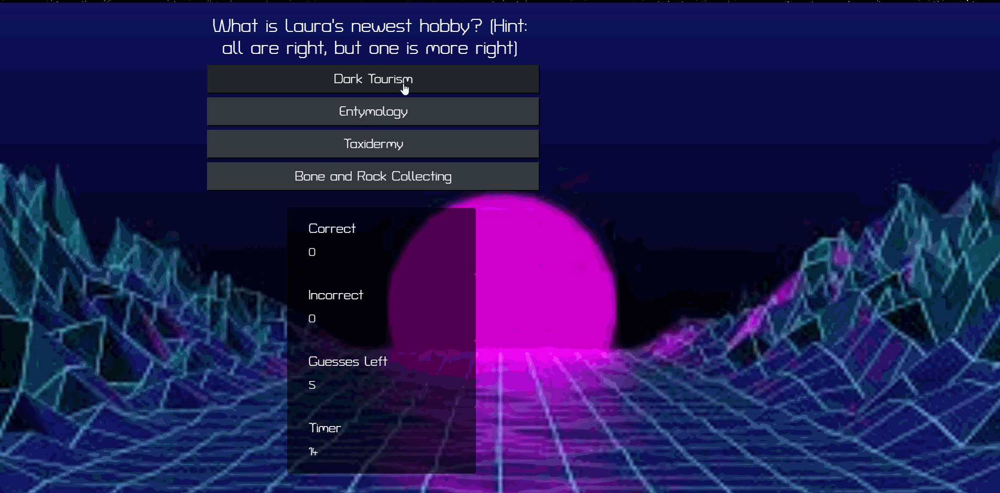
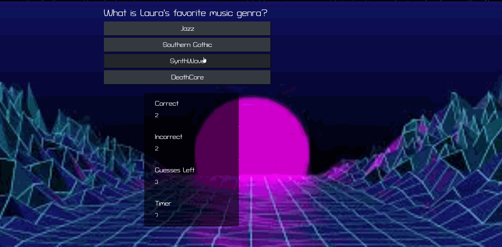
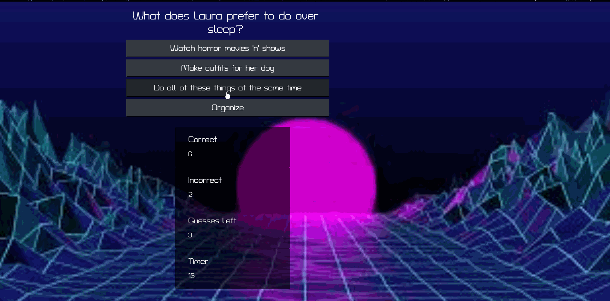

# Learning about Laura 
## Functionality: 

* Gamma will help you expand your vocabulary, save your favorites, and eventually... test those those newfound words!

## Local Usage
* Clone this repo to your computer
* In the project directory, run `$npm install`
* Edit `PORT` and `DB` configuration if necessary/desired 
* Run `npm start` or `node app` to start your server and use this project on your own

## Technologies: 
* [Javascript](https://www.javascript.com/) - The scripting language used to manipulate the DOM.  
* [JQuery](https://jquery.com/) - jQuery is a fast (arguable), small, and feature-rich JavaScript library.
* [HTML5](https://developer.mozilla.org/en-US/docs/Web/Guide/HTML/HTML5) - Mark up language used for structuring pages. 
* [BootStrap](https://getbootstrap.com/) - popular framework for building responsive websites
* [CSS](https://developer.mozilla.org/en-US/docs/Web/CSS) -is a stylesheet language used to describe the presentation of a document written in HTML or XML

## Heroku Link: 
* Repo: [Git hub Repo](https://github.com/lmd808/trivia_game).
* Deployed: [Git Hub Pages](https://lmd808.github.io/Trivia_Game/).

# HomePage and Quick Site Demo:  

Challenges: 
* The timing logic wass extremely difficult for me to get a handle on, but I findally figured it out. It was super interesting to see the logic that plays out in *actual* trivia games. 

## Creator: 
Laura DiTommaso [GitHub](https://github.com/lmd808)

